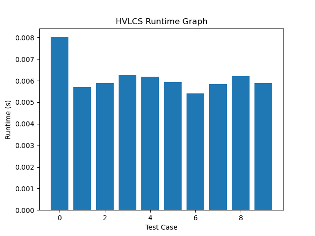

# Programming Assignment 3

Harrison Chojnowski: `46524954`

Pranav Annapareddy: `21340719`

**Running our code:**

The executable is actually saved to the repo so you can just run:
```bash
./hvlcs < data/example.in
```
from the project root.

If you need to recompile the script, you will need a valid C++ compiler. Then you can run,
```bash
g++ -o hvlcs src/main.cpp src/hvlcs.cpp
```
and then repeat the command above.

Assume the inputs follow the same format as given in the project specifications, namely:

```
3
a 2
b 4
c 5
aacb
caab
```
Where the first line has the number of chars `n`, the next next `n` lines have the char followed by its value. Then the two char sequences of equal length.

# Written Questions

## Question 1:

